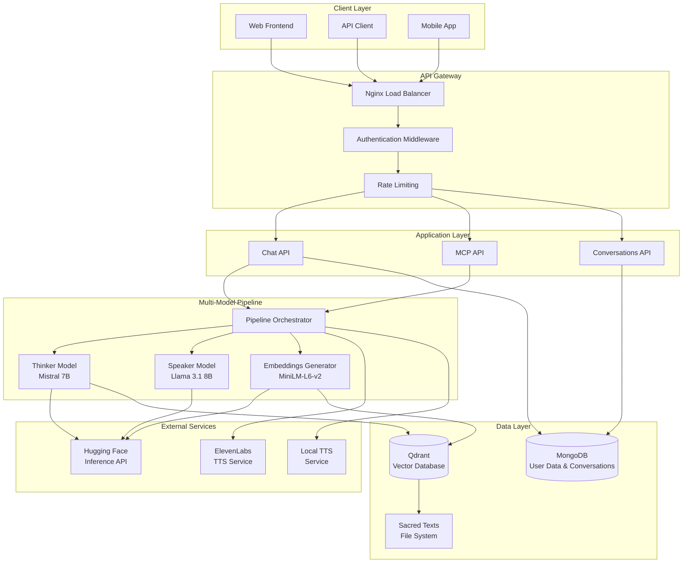
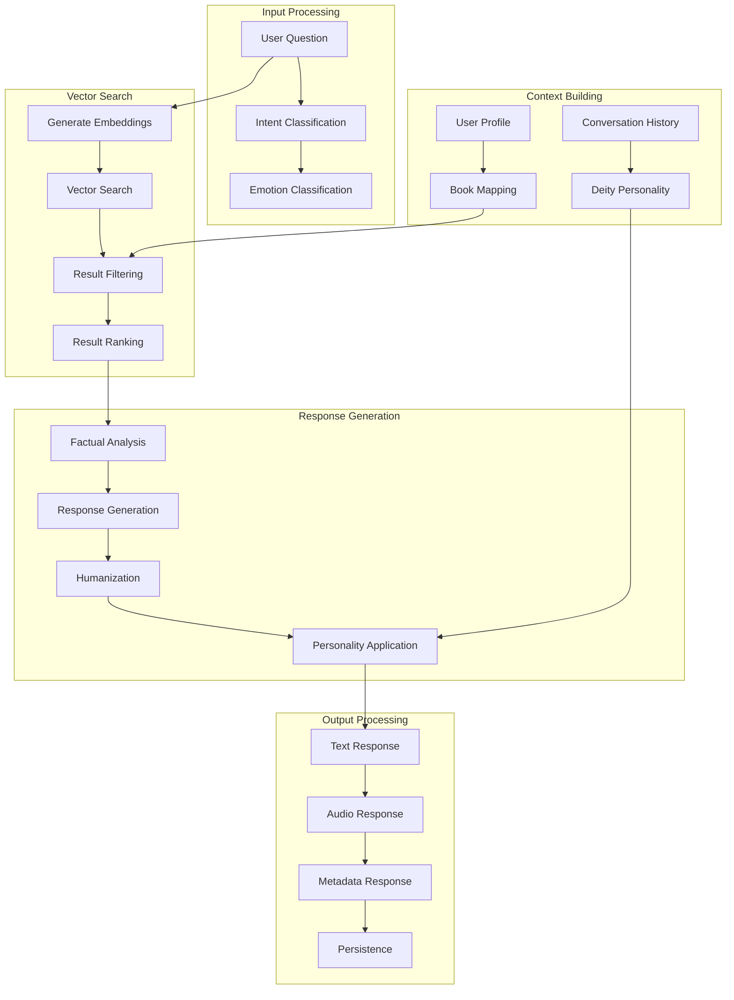
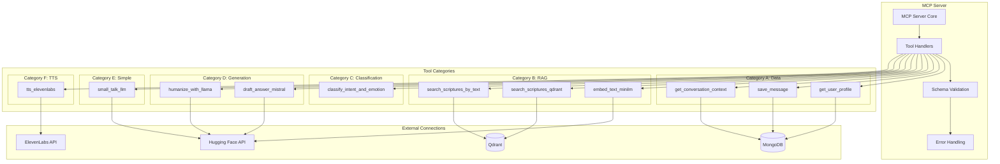
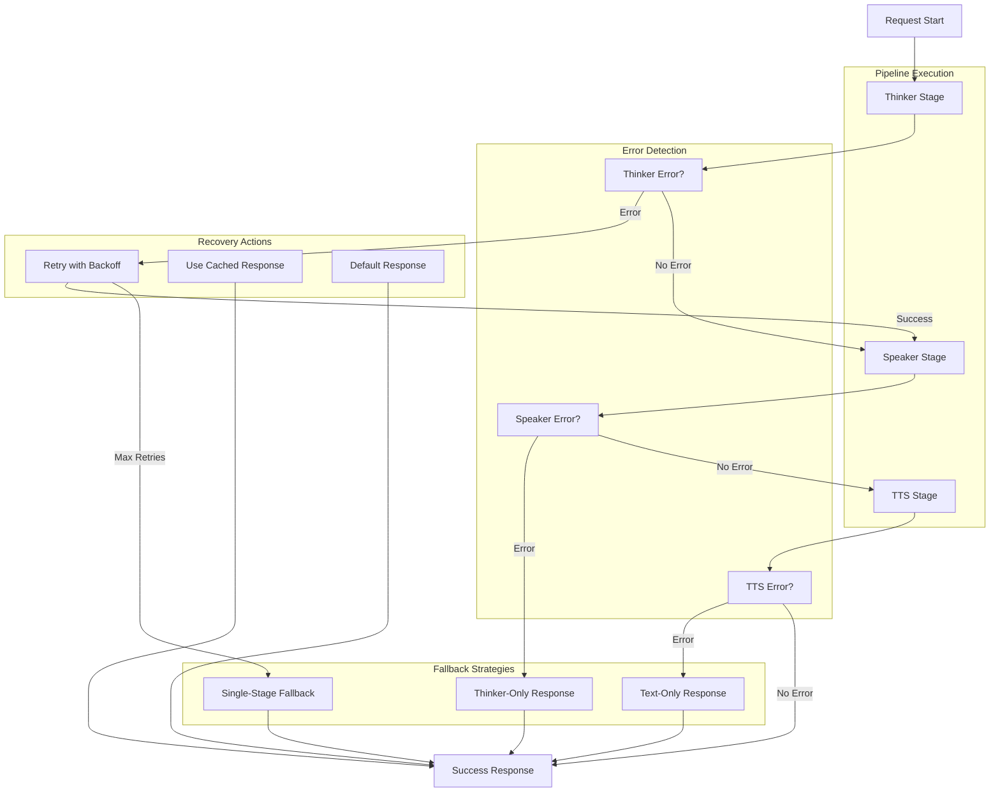
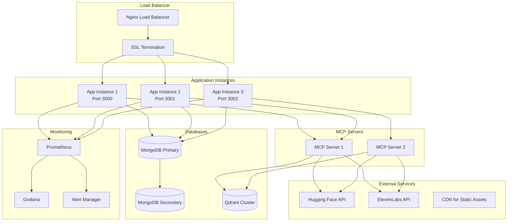
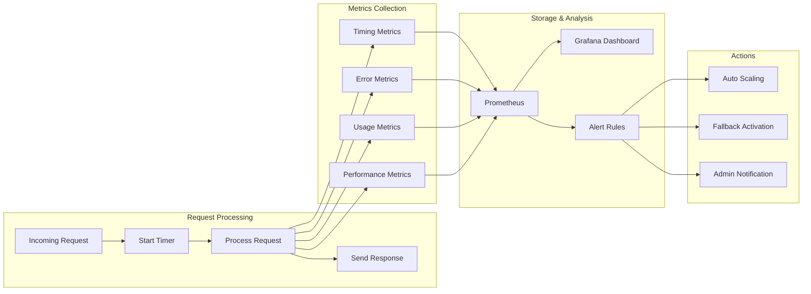
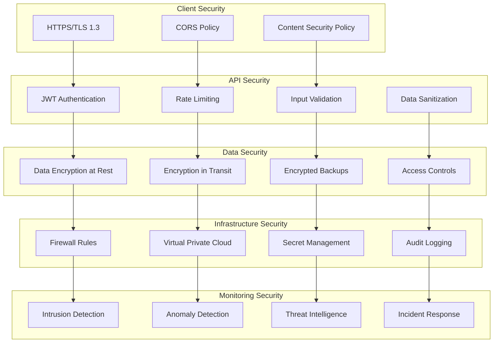
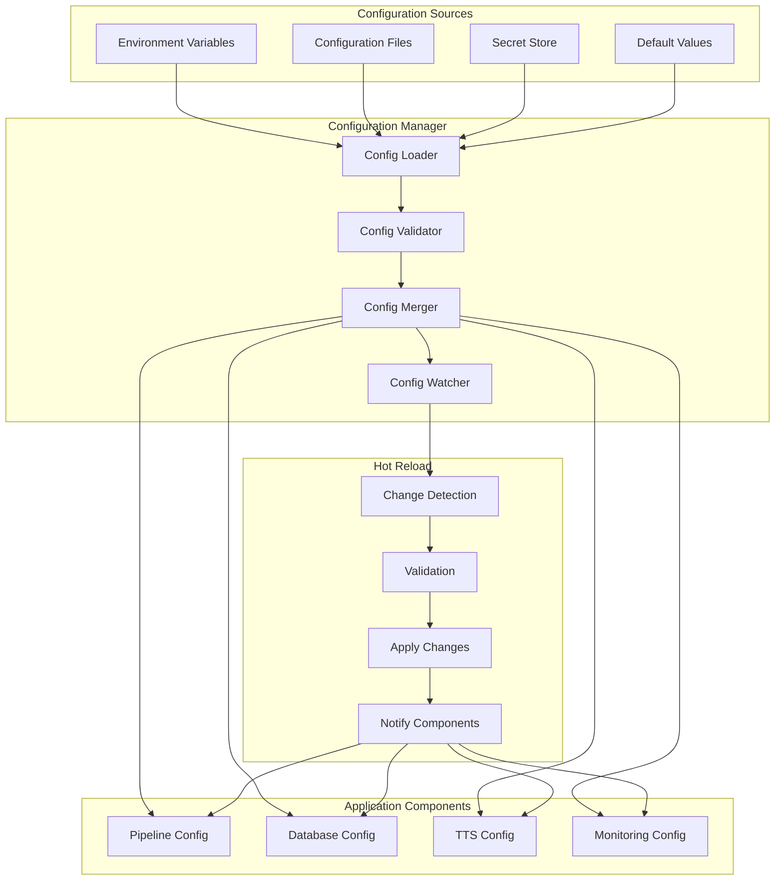

# MythAI System Architecture Diagrams

## High-Level System Architecture



## Two-Stage Pipeline Flow

```mermaid
sequenceDiagram
    participant User
    participant API as Chat API
    participant Orch as Pipeline Orchestrator
    participant Think as Thinker Model
    participant Embed as Embeddings Generator
    participant VDB as Vector Database
    participant Speak as Speaker Model
    participant TTS as TTS Service
    
    User->>API: POST /api/chat
    API->>Orch: processTwoStage(question, context)
    
    Note over Orch: Stage 1: Thinker Processing
    Orch->>Think: process(question, context)
    Think->>Embed: generate(question)
    Embed-->>Think: embeddings[384]
    Think->>VDB: search(embeddings, filters)
    VDB-->>Think: passages[]
    Think->>Think: analyzeRelevance(passages)
    Think->>Think: extractReferences(passages)
    Think-->>Orch: ThinkerOutput{factual, quotes, refs}
    
    Note over Orch: Stage 2: Speaker Processing
    Orch->>Speak: process(thinkerOutput, context)
    Speak->>Speak: loadPersonality(deityId)
    Speak->>Speak: analyzeEmotion(question)
    Speak->>Speak: simplifyText(quotes)
    Speak->>Speak: humanizeResponse(factual)
    Speak-->>Orch: SpeakerOutput{response, emotion}
    
    Note over Orch: Stage 3: TTS (Optional)
    Orch->>TTS: generateSpeech(response, emotion)
    TTS-->>Orch: audioBuffer
    
    Orch-->>API: PipelineResult{text, audio, metadata}
    API-->>User: Response with timing & metadata
```## C
omponent Architecture

```mermaid
graph LR
    subgraph "Pipeline Orchestrator"
        PO[Pipeline Orchestrator]
        EH[Error Handler]
        FB[Fallback Logic]
        METRICS[Metrics Collector]
    end
    
    subgraph "Thinker Stage"
        TM[Thinker Model]
        EG[Embeddings Generator]
        QC[Qdrant Client]
        RE[Reference Extractor]
    end
    
    subgraph "Speaker Stage"
        SM[Speaker Model]
        PM[Personality Matcher]
        TC[Text Complexity Analyzer]
        FE[Fact Extractor]
    end
    
    subgraph "Support Services"
        CM[Configuration Manager]
        RQ[Request Queue]
        CC[Cache Manager]
        SP[Streaming Pipeline]
    end
    
    PO --> TM
    PO --> SM
    PO --> EH
    PO --> METRICS
    
    TM --> EG
    TM --> QC
    TM --> RE
    
    SM --> PM
    SM --> TC
    SM --> FE
    
    PO --> CM
    PO --> RQ
    EG --> CC
    PO --> SP
    
    EH --> FB
```

## Data Flow Architecture



## MCP Server Architecture



## Error Handling & Fallback Flow



## Deployment Architecture



## Performance Monitoring Flow



## Security Architecture



## Configuration Management



## Legend

- **Rectangles**: Services/Components
- **Cylinders**: Databases/Storage
- **Diamonds**: Decision Points
- **Circles**: Start/End Points
- **Arrows**: Data/Control Flow
- **Subgraphs**: Logical Groupings

## Notes

1. **Scalability**: The architecture supports horizontal scaling of application instances
2. **Reliability**: Multiple fallback mechanisms ensure system availability
3. **Performance**: Caching and streaming optimize response times
4. **Security**: Multiple layers of security protect data and access
5. **Monitoring**: Comprehensive monitoring enables proactive issue resolution
6. **Flexibility**: Modular design allows easy component replacement and updates